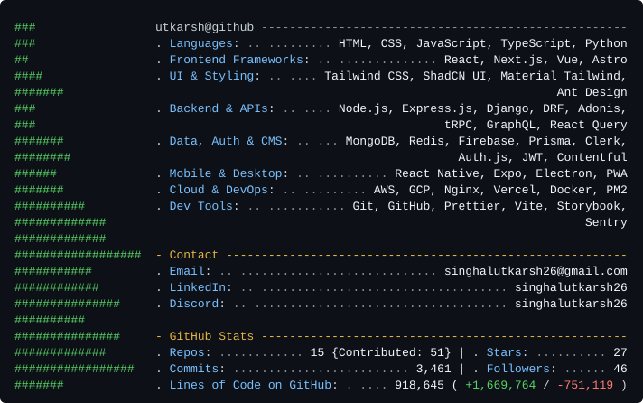
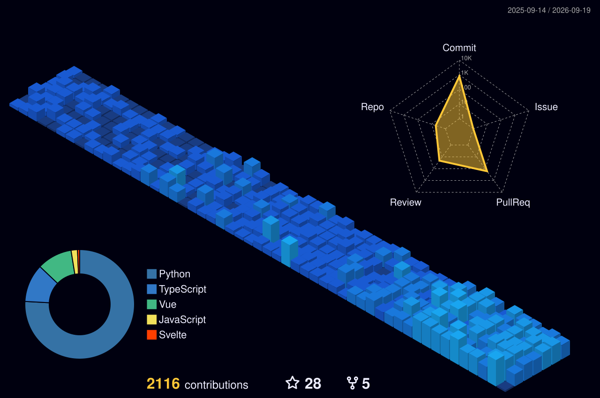

# Hi there! 👋 I'm Utkarsh Singhal

I'm a passionate **Software Developer** and **Full Stack Developer** from India. I specialize in building web and mobile applications, focusing on performance, scalability, and user experience.

 

Visit my portfolio website: [utkarsh-singhal.is-a.dev](https://utkarsh-singhal.is-a.dev/)



---

[](https://github-readme-activity-graph.vercel.app/graph?username=Utkarsh-Singhal-26&theme=react-dark)

---

## 🛠 Open Source PRs

<!-- START_LATEST_PRS -->
- kubestellar/console#21527
- DavidHDev/vue-bits#171
- DavidHDev/react-bits#1009
- ansvisor/ansvisor#509
- shadcn-ui/ui#11066
- DavidHDev/svelte-bits#20
<!-- END_LATEST_PRS -->

---

<!--START_SECTION:waka-->
```text
Total Time: 1,439 hrs 51 mins

TypeScript           679 hrs 40 mins        🟩🟩🟩🟩🟩🟩🟩🟩🟩🟩🟩🟨⬜⬜⬜⬜⬜⬜⬜⬜⬜⬜⬜⬜⬜   46.52 %
Python               396 hrs 32 mins        🟩🟩🟩🟩🟩🟩🟨⬜⬜⬜⬜⬜⬜⬜⬜⬜⬜⬜⬜⬜⬜⬜⬜⬜⬜   27.14 %
Vue.js               63 hrs 49 mins         🟩⬜⬜⬜⬜⬜⬜⬜⬜⬜⬜⬜⬜⬜⬜⬜⬜⬜⬜⬜⬜⬜⬜⬜⬜   04.37 %
JavaScript           54 hrs 11 mins         🟨⬜⬜⬜⬜⬜⬜⬜⬜⬜⬜⬜⬜⬜⬜⬜⬜⬜⬜⬜⬜⬜⬜⬜⬜   03.71 %
JSON                 51 hrs 20 mins         🟨⬜⬜⬜⬜⬜⬜⬜⬜⬜⬜⬜⬜⬜⬜⬜⬜⬜⬜⬜⬜⬜⬜⬜⬜   03.51 %
```
<!--END_SECTION:waka-->


